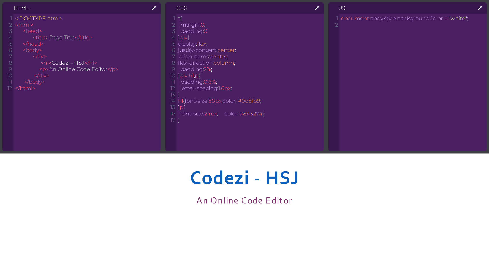

# Codezi-HCJ-Online-Code-Editor

### Codezi-HCJ is an online code editor build in ReactJS. The website allows you to write code in the browser, and see the results of it as you build. 

 

## Visit the Editor here - [Codezi-HCJ](https://onlinecodeeditor.web.app/)

 

## Features 

<h3> 1. Specific colors for Html tag names. </h3>
 <h3> 2. Error Detection.</h3>
<h3> 3. Automatically loads the code every 250ms.<h3>
 <h3>4. Collapse and expand any editor with a single click.<h3>
 <h3>5. Line numbers displayed on the left.<h3>

 

## Screen

 

